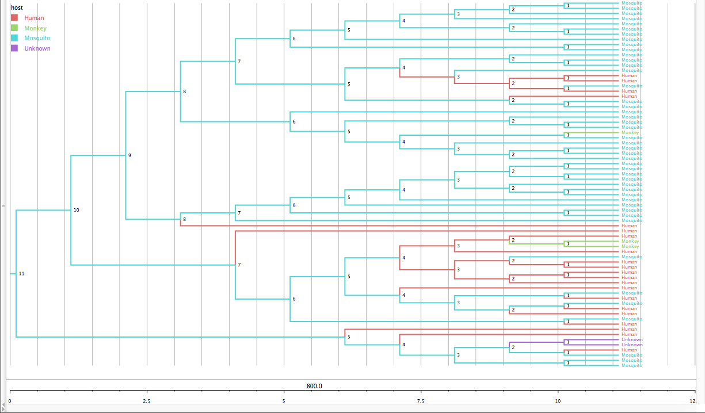

<html>
<link rel="stylesheet" type="text/css" href="eba.css">
<body>
<h1>Yellow-Fever outbreaks in Africa and South America</h1>

Click this link to go to my website:<a href ="https://ebaberga.github.io/yellow-fever"> YELLOWFEVER</a>

<h4>For information about Yellow Fever....<a href= ""> HERE</a></h4>
<h2>Project Question:</h3>
<ol>
<li>How similar or Different is the yellow fever outbreaks in Africa and Brazil?</li>
<li>What can we tell about the host variation among this region?</li>
 
</ol>
<h3>Countries I am Specifically interested in:</h2>
<ul>
  <li>Senegal</li>
  <li>Ethiopia</li>
  <li>Egypt</li>
  <li>Sudan</li>
  <li>Brazil</li>
  <li>Mali</li>
  <li>Nigeria</li>
  <li>Gambia</li>
  <li>Mauritania</li>
  <li>Uganda</li>
</ul>

All my sequence are draged from ViPR  http://www.viprbrc.org/brc/vipr_genome_search.spg?method=SubmitForm&blockId=2713&decorator=flavi

<h3>I used the following application softwares throughout my project to do multiple tasks:</h3>
<ol>
<li>Iphyton: to build my subdata sets https://github.com/ebaberga/yellow-fever/blob/gh-pages/Ipython/Yellow-fever.ipynb </li>
<li>Geneious: to do my alignments using MAFT and draw a phylogenetic tree using RAFT of the sequences I filtered out using Iphyton.</li>
<li>Figtree: to graphically view my phylogenetic tree and publish ready figure.</li>
<li>Beauti: a companion program in Beast that generate XML file inorder to make the file readable by Beast. </li>
<li>Beast: to infer evolutionary dynamics from sequence data.</li>
</ol>
<h3>The following phylogenetic tree demonstrates the variation of hosts in different parts of Africa and Brazil:</h3>

<h4>Things I understood from my Phylogenetic tree:</h4>
<ul>
<li>Most of the mosquito hosts are found in African counties, while most human hosts are found in Brazil.</li>
<li>The virus tends to stay in a single type of host for a long time, it doesn't jump around other hosts often. </li>
<li>According to my data most of the hosts are mosquitos. So mosquitos could be more compatible with the viruses function.</li>
<li>The tree demonstrate that it is possible for Yellow Fever virus to jump from one species to another.</li>
</ul>
<ol>
<li>How similar or Different is the yellow fever outbreaks in Africa and Brazil?</li>
</ol>
<h5>Hypothesis:</h5>

Since the only means for the transmission of the virus from any host to a human being is through mosquitos, the outbreak in both region started when the virus suddenly jumped from a mosquito to a human being.

<ol>
<li>What can we tell about the host variation among this region?</li>
</ol>

The fact that there have been a lot of outbreaks in Africa and Brazil make it suspicious  that almost all viruses in Brazil have a mosquito host not human. So my assumption is that researcher collected samples from Mosquitos in Brazil not humans.

</body>
</html>

